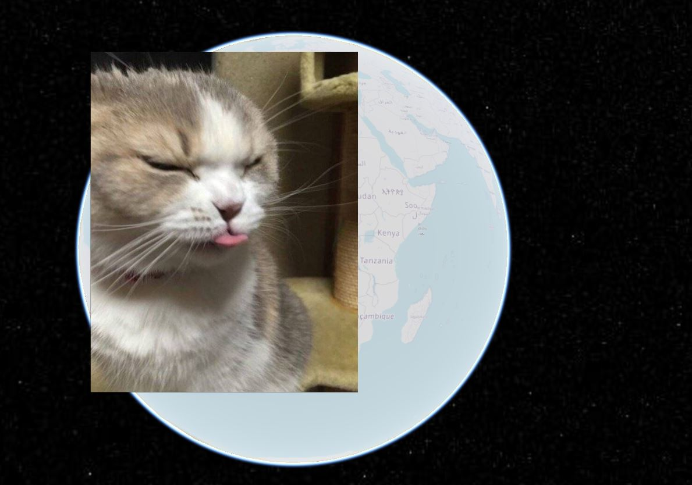
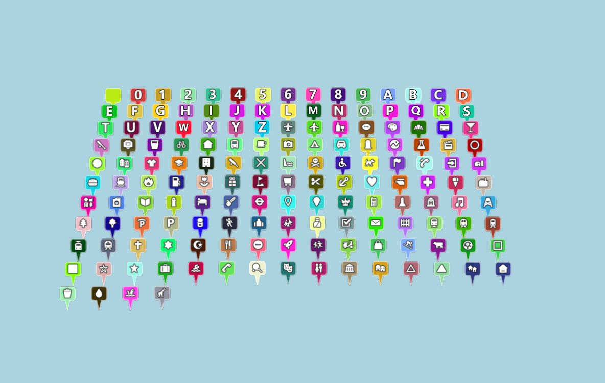
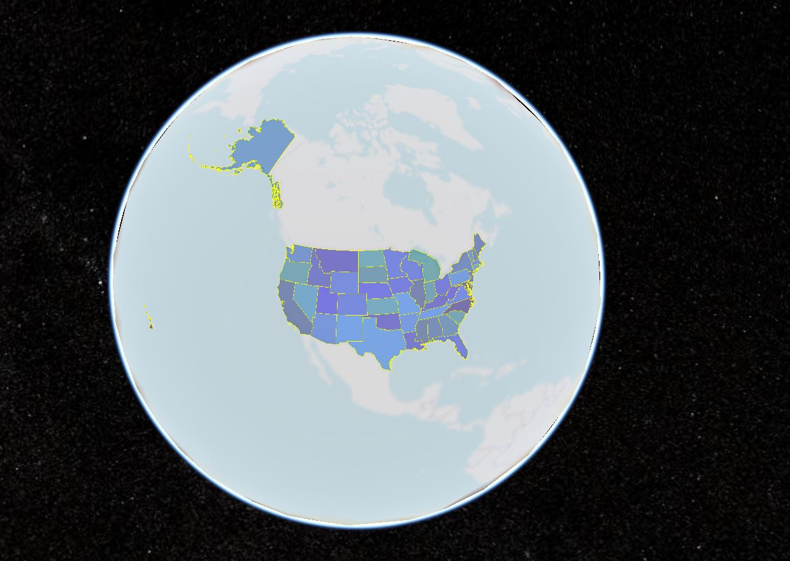
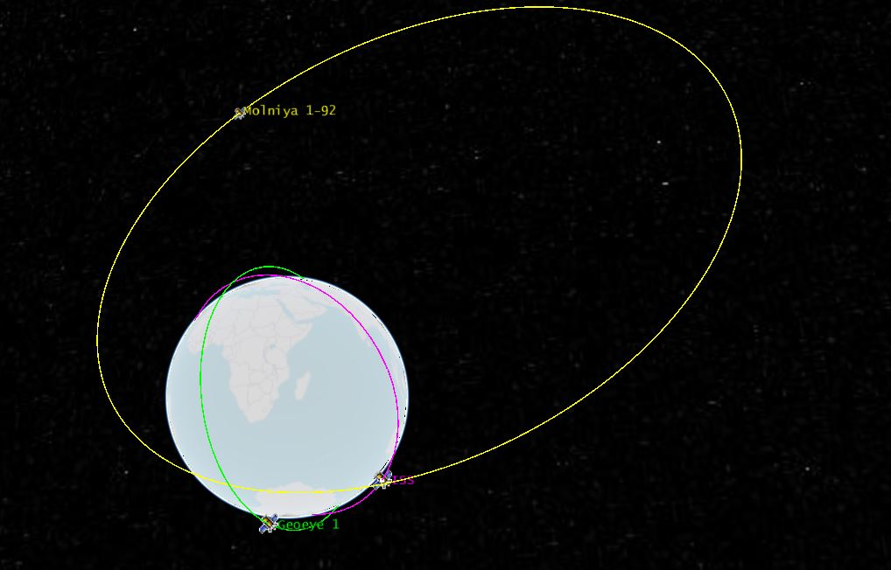
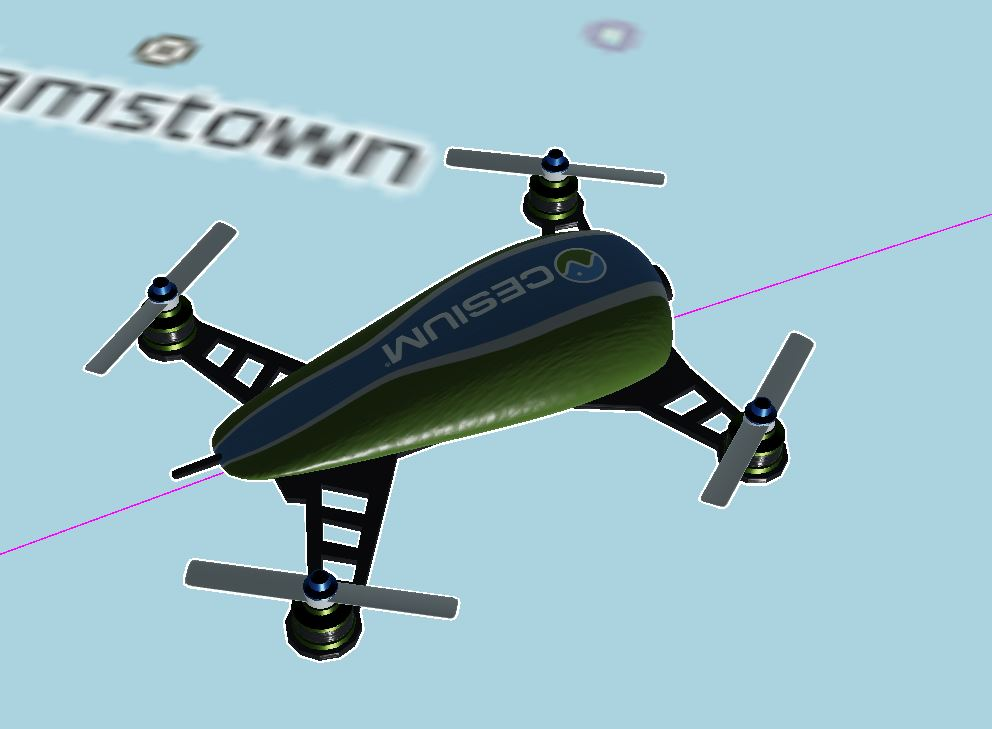

# dataSource加载示例展示

## customDataSource

```js
let dataSource = new CDataSource(viewer, "customDataSource", "myData");
let dS = dataSource._Init({});
dS.entities.add({
  position: Cartesian3.fromDegrees(118.05741, 24.630362, 100),
  billboard: {
    image: "http://localhost:8091/Images/cat.jpg",
  },
});
viewer.dataSources.add(dS);
```



## GeoJsonDataSource

```js
let dataSource = new CDataSource(
  viewer,
  "json",
  "http://localhost:8091/SampleData/simplestyles.geojson"
);
let dS = dataSource._Init({
  clampToGround: true,
});
dS.then((res: DataSource) => {
  viewer.dataSources.add(res);
  viewer.zoomTo(dS);
});
```



## topojson

```js
let dataSource = new CDataSource(
  viewer,
  "json",
  "http://localhost:8091/SampleData/ne_10m_us_states.topojson"
);
let dS = dataSource._Init({
  clampToGround: true,
});
dS.then((res: DataSource) => {
  let entities: Entity[] = res.entities.values;
  for (let entity of entities) {
    if (entity && entity.polygon && entity.polygon.hierarchy) {
      if (defined(entity.polygon)) {
        // * 设置材质
        entity.polygon.material = new ColorMaterialProperty(
          Color.fromRandom({
            red: 0.1,
            maximumGreen: 0.5,
            minimumBlue: 0.5,
            alpha: 0.5,
          })
        );
        // * 设置实体的文字
        entity.label = new LabelGraphics({
          text: entity.name,
          showBackground: true,
          scale: 0.6,
          horizontalOrigin: HorizontalOrigin.CENTER, // * 标签的左右位置
          verticalOrigin: VerticalOrigin.BOTTOM, // * 标签的垂直位置
          distanceDisplayCondition: new DistanceDisplayCondition(10.0, 10000000.0), // * 标签离摄像机多远时显示
          disableDepthTestDistance: 100.0,
        });
      }
    }
  }
  viewer.dataSources.add(res);
  viewer.zoomTo(dS);
});
```



## czml

```js
let dataSource = new CDataSource(
  viewer,
  "czml",
  "http://localhost:8091/SampleData/simple.czml"
);
let dS = dataSource._Init({});
dS.then((res: DataSource) => {
  viewer.dataSources.add(res);
  let drone = res.entities.getById("Satellite/ISS");
  // * 替换glb
  if (drone && drone.position) {
    drone.model = new ModelGraphics({
      uri: "http://localhost:8091/SampleData/models/CesiumDrone/CesiumDrone.glb",
      minimumPixelSize: 128, // * 最小像素大小
      maximumScale: 1000, // * 最大比例尺寸
      silhouetteColor: Color.WHITE, // * 轮廓颜色
      silhouetteSize: 3, // * 轮廓大小
    });
    // * 计算并设置模型方向
    drone.orientation = new VelocityOrientationProperty(drone.position);
    // * 位置插值使运动平滑
    // drone.position.setInterpolationOptions({
    //   interpolationDegree: 3,
    //   interpolationAlgorithm: HermitePolynomialApproximation, // * 插值算法
    // });
  }
});
```




