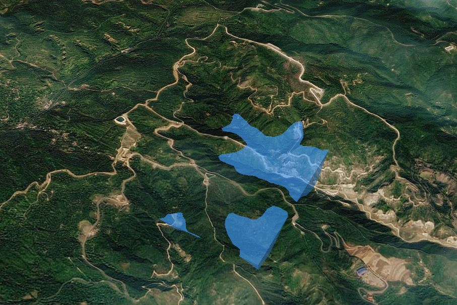
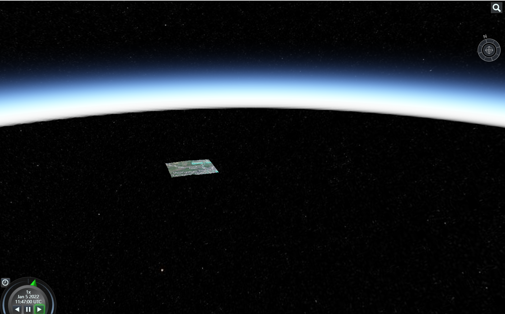

# 淹没分析示例展示

## floodAnalysis

```js
viewer.scene.globe.depthTestAgainstTerrain = true;
let obj = new SubmergenceAnalysis(
  viewer,
  3800,
  1000,
  1,
  [
    112.419718,
    37.927023,
    112.442443,
    37.916786,
    112.435592,
    37.904635,
    112.411082,
    37.915696,
  ],
  0.05
);
obj.start();
```



## loadGrandCanyon 地形开挖

```js
viewer.scene.globe.depthTestAgainstTerrain = true;
let obj = new SubmergenceAnalysis(
  viewer,
  3800,
  1000,
  1,
  [
    112.419718,
    37.927023,
    112.442443,
    37.916786,
    112.435592,
    37.904635,
    112.411082,
    37.915696,
  ],
  0.05
);
obj.loadGrandCanyon();
```


